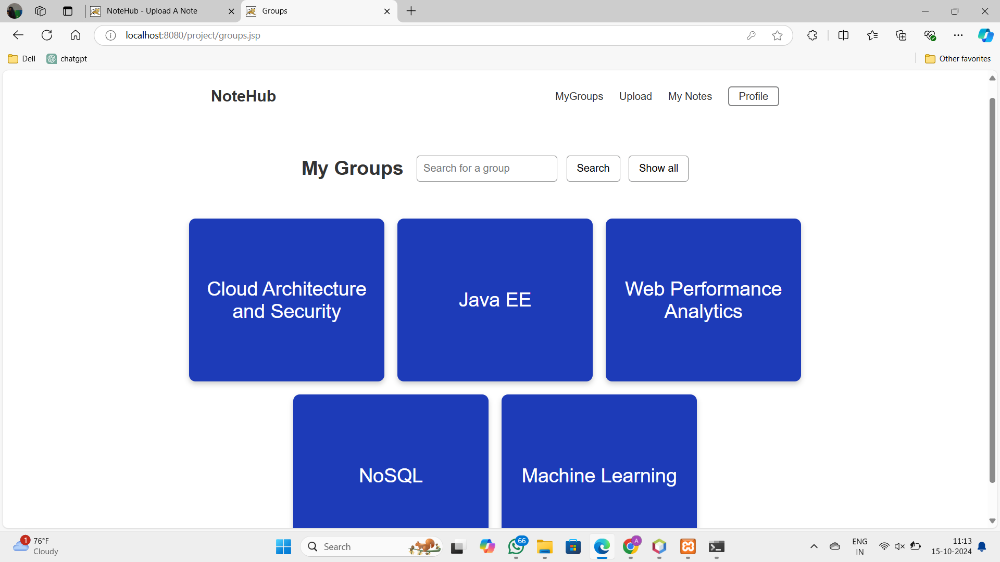

# NoteHub - A Collaborative Notes Sharing Platform

**NoteHub** is a web-based platform developed using **Java EE** that allows users to create, share, and access notes efficiently. It serves as a collaborative environment where users can organize notes into groups, upload documents, and interact with educational content. This project is ideal for students, professionals, and anyone looking to manage and share notes across various topics or subjects.

---

## Features

- **User Registration & Login**:  
  Secure user authentication allowing users to create accounts and log in.
  
- **Groups and Notes**:  
  Users can join or create groups and access shared notes within the group.  
  Clicking on a group in the `groups.jsp` page displays notes relevant to that group.

  

- **Document Uploads**:  
  Users can upload notes/documents to share with others, with all files stored securely in the backend database.

  

- **Profile Management**:  
  After logging in, users can view their profile and see the notes they've uploaded.

  <div style="display: flex; justify-content: space-around;">
      
      
  </div>

- **Dynamic Content Display**:  
  Notes and files are dynamically fetched from the database based on user interactions, offering a smooth and responsive experience.

  

- **Session Management**:  
  Sessions are maintained to ensure secure and seamless user experiences during each interaction.

---

## Tech Stack

- **Backend**: Java EE (JSP, Servlets)
- **Frontend**: HTML, CSS, JavaScript
- **Database**: MySQL for storing user data, groups, and notes.
- **Server**: Apache Tomcat

---

## Future Scope

- **Profile Editing**: Users should be able to edit their profile.
- **Notes Editing**: Users should be able to edit notes in real-time.
- **Admin dashboard**: A responsive dashboard for admin that contains data analysis.
  
---

## How to Run

1. **Clone the Repository**:
   ```bash
   git clone https://github.com/your-username/NoteHub.git
